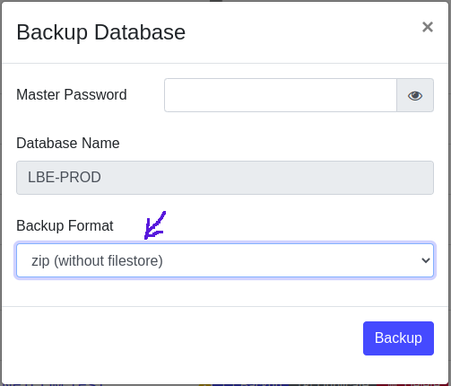

Database backup without filestore
----------------------------------
Odoo has 2 types of database backup: the first one is __Zip (with filestore)__,this is the default one that is used to backup all the database content and restore them later directly with odoo
interface,the seconde one is __pg_dump custom format (without filestore)__,this type of backup is used when we don't need the filestore of the database 
to be restored,but the downside of this type of backup is that is technical and must be used with postgres commande,
this module aims to add third type that can be used when we don't need the filestore but still using the simplicity of odoo interface to restore the database.

Usage
----------------------------------
First thing we have to install the module like any module any odoo,after that we have to go to the database list interface and try to backup any database
the wizard of the backup will be displayed and like illustrated bellow the new option will appear

> **Note:**
> If there are many databases installed in the server,you have to install this module on all databases,this is necessary because when we try to enter to a database by clicking in it's link ,
> the code of this feature will be removed automatically from memory because the module is not installed ,this is specific (and maybe strange) behaviour because the scope of the module is outside
> the database on which it is installed